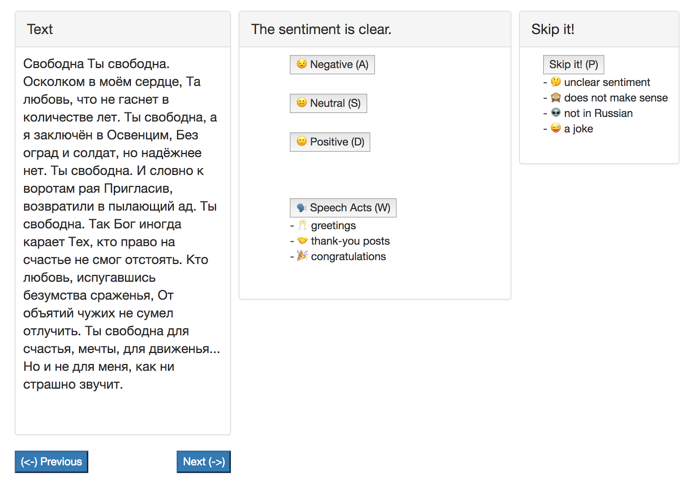

# RuSentiment Post Sentiment Annotation Guidelines

- [Annotation tool interface](#head1)
- [Sentiment annotation](#head2)
- [Positive speach acts](#head3)
- [Posts that dont express sentiment](#head4)
- [Smileys](#head5)
- [Hashtags](#head6)
- [Mixed sentiment](#head7)
- [What to skip](#head8)
- [Training examples](#head9)

# Annotation tool interface

In order to use our web-interface, you will first complete a training. **Finish reading these guidelines before you proceed.** You will receive links and credentials for accessing the interface from the coordinator.  You will be presented with a set of training posts that are pre-annotated; after you enter your annotation, you will see how they should in fact be annotated. If anything is not clear, please refer to these guidelines again.

# Sentiment annotation

In sentiment analysis, our goal is to isolate the feeling or attitude being conveyed through a post on social media. Some posts express an obvious positive or negative sentiment or attitude towards something, and we need to select such clear, unambiguous cases. 

The sentiment conveyed in text may refer to (1) the speaker’s subjective mood, feeling, or emotion, or to (2) the speaker’s attitude towards something.  For example:
<table class="tg">
  <tr>
    <th class="tg-031e">(1) Speaker mood/emotions</th>
    <th class="tg-031e">(2) Evaluation of an entity or event</th>
  </tr>
  <tr>
    <td class="tg-031e">I am so excited!</td>
    <td class="tg-031e">Princess and the frog is a great movie</td>
  </tr>
  <tr>
    <td class="tg-031e">I am happy</td>
    <td class="tg-031e">Our Country is doing great</td>
  </tr>
</table>

Both the speaker’s mood and their attitude towards something can be positive or negative:

<table class="tg" style="width: 652px;">
<tbody>
<tr>
<th class="tg-031e" style="width: 182px;">&nbsp;</th>
<th class="tg-031e" style="width: 227px;">Positive</th>
<th class="tg-031e" style="width: 233px;">Negative</th>
</tr>
<tr>
<td class="tg-031e" style="width: 182px;">Emotions, mood of the speake</td>
<td class="tg-031e" style="width: 227px;">

happiness, pride, love, inspiration, serenity, interest&hellip;

<ul>
<li>I am proud of my work</li>
<li>Really pleased to announce their engagement...</li>
<li>So excited. Yay!</li>
</ul>
</td>
<td class="tg-031e" style="width: 233px;">

sadness, anger, fear, hatred, pain, disgust, shame, guilt&hellip;

<ul>
<li>I am so tired of waking up sad in the morning</li>
<li>I am mad as hell for way too many reasons</li>
</ul>
</td>
</tr>
<tr>
<td class="tg-031e" style="width: 182px;">Evaluation, attitude towards some entity or event</td>
<td class="tg-031e" style="width: 227px;">
<ul>
<li>I'm looking forward to next year's July event</li>
<li>I like the kind of people who get excited about the stars at night</li>
<li>people who keep their word are real</li>
</ul>
</td>
<td class="tg-031e" style="width: 233px;">
<ul>
<li>I am literally disgusted at the crowd</li>
<li>Yes, you are racist, sexist, homophobic, and xenophobic if I find out you voted for Trump.</li>
</ul>
</td>
</tr>
</tbody>
</table>

All of the above cases (whether they deal with the speaker’s emotions/mood or evaluation/attitude) are cases of explicit sentiment - you can tell the sentiment because it is clearly stated in the post. However, in many cases the sentiment may be implicit - you can understand how the speaker feels or what his/her attitude towards something is, but it is not expressed directly. Cases of implicit sentiment include:

<table class="tg" style="width: 637px;">
<tbody>
<tr>
<th class="tg-l711" style="width: 137px;">&nbsp;</th>
<th class="tg-l711" style="width: 229px;">Positive</th>
<th class="tg-l711" style="width: 259px;">Negative</th>
</tr>
<tr>
<td class="tg-l711" style="width: 137px;">Wishing (or not) for something, recommendations  EVALUATION IS IMPLIED</td>
<td class="tg-l711" style="width: 229px;"> 
<ul>
<li>Definitely follow these bloggers in 2018</li>
<li>You should have a functional brain, an enduring spirit and a praying tongue</li>
<li>Try the keto diet</li>
</ul>
</td>
<td class="tg-l711" style="width: 259px;">
<ul>
<li>THIS! MUST! STOP!!</li>
<li>Enough, hyping up our news</li>
<li>No one should have to go through this</li>
<li>I wouldn't wish that on a dog.</li>
</ul>
</td>
</tr>
<tr>
<td class="tg-l711" style="width: 137px;">Descriptions of experience that most people would consider positive or negative  EMOTION IS IMPLIED</td>
<td class="tg-l711" style="width: 229px;">
<ul>
<li>We won! All the love Sometimes it only takes a sunset to make you realize that life is still worth living after all</li>
<li>I got promoted to assistant manager yaaaasToday, my beautiful #bestie beat cancer&rsquo;s ass!</li>
</ul>
</td>
<td class="tg-l711" style="width: 259px;">
<ul>
<li>My favourite grandparent is dying, my parent might have cancer, a close friend is at a bad place mentally and I just lost my most cherished job- things have been very tough.</li>
<li>This is the heartbreaking reality of @realDonaldTrump&rsquo;s barbaric family separation policy. This must end. And it must end immediately.</li>
<li>I&rsquo;m watching Anthony Bourdain: Parts Unknown and, realize that someone like him is actually gone.</li>
</ul>
</td>
</tr>
<tr>
<td class="tg-l711" style="width: 137px;">Questions with clear implicit sentiment (often rhetorical)  EMOTION is IMPLIED</td>
<td class="tg-l711" style="width: 229px;">&nbsp;</td>
<td class="tg-l711" style="width: 259px;">
<ul>
<li>Hmm How can I fix this now???</li>
<li>I don't understand how this keeps happening</li>
<li>How am I always late to everything??</li>
</ul>
</td>
</tr>
</tbody>
</table>

Unfortunately, it is not always the case that a whole single post fits one of the above categories. If the post contains several expressions of sentiment, we ask you to annotate the polarity of the post as a whole, which we define as **the dominant, prevailing sentiment**. Annotation of the mixed sentiment posts (such as the posts containing both positive and negative sentiment) is discussed in more detail [here](#head4).

Posts may express sentiment of two different types, for example, the speaker's mood and the speaker's attitude towards something.  The polarity of these may be the same or it may differ, creating a mixed-sentiment post.  Often, the polarity will be the same.  For example, “Great! I won a free ticket!” has both an explicit evaluation of the event (Great!) and describes the experience that would be positive for many people (won free ticket). It is clear that the polarity of the post as a whole is also positive. 

# Positive speech acts 
A large portion of posts express perform the functions of various speech acts: expressing gratitude for something, congratulating a user or a group of users, greeting them. We treat these as a separate subcategory because, although generally greetings, congratulations and gratitude imply positive sentiment, they can also be performed, e.g., out of a feeling of obligation or under social pressure. So we would like to keep it an option to add or remove them in different research scenarios. 

This group includes: 

**Expressions of gratitude:**
- Thank you to everyone for the birthday wishes too  I appreciate all of your messages! 
- Special thanks to our mentors, Mr. Robert Lim and Ms. Arbie Belmonte. 
- I appreciate how far we have come  

**Congratulations:**
- Wish u happy bday macha.. live and be happy... 
- Happy 13 years anniversary to the cutest couple in the World!!! 
- Happy 4th of July guys! Here is my gift to you today!

**Good wishes to someone:**
- Good luck to you in your new adventure, Jack. You deserve it!
- Kind regards and best wishes from Checkpoint Charlie

**Greetings:**
- Good morning everyone! How are you doing today?
- Heyy girl ! long time no see..
- What’s up!. how have you been?

If there is clear irony, treat these as cases of mixed sentiment.

# Posts that dont express sentiment

"No sentiment” label is reserved for **posts that simply describe some situation in a neutral, matter-of-fact way**, and have no clear positive or negative sentiment. For example:

- my friend is coming down from Indiana today to see your show tonight  [no sentiment]
- 18 new friend requests   [no sentiment]
- french toast, bacon, and scrambled egg  [no sentiment]

The same label applies to most **matter-of-fact, non-rhetorical questions**:
- Now, my friends, are you coming with me?  [no sentiment]
- Where did you put my keys?  [no sentiment]
- So, what's new?  [no sentiment]

If the post carries no overall sentiment, but is followed by smileys, please use the “no sentiment” label. For example:
 - I am back online:)))😝  [no sentiment]
 - Here is some actual data 😅😍  [no sentiment]

Other categories of posts that should be annotated with “no sentiment” label include:

**(1) Advertisements:**

- Free, confidential & friendly advice for people living in Central Bedfordshire. Try AdviceCentral for help on a wide range of topics.  [no sentiment]
- We are looking for a Graphic Designer! Immediate position, in office only - no freelance. Come join us for our annual Open House this Saturday, July 14th! Lot of great hand-on opportunities for kids and adults!  [no sentiment]
- My yacht is officially for sale. Highest bidder by Friday gets it  [no sentiment]

**(2) Professional plot summaries of movies, books, etc:**

- The first Deadpool remains one of my very favorite superhero movies and the sequel at least from what we've seen appears to retain the same humorous spirit that made the original so great.  [no sentiment]

- "What Happened” is not one book, but many. It is a candid and blackly funny account of her mood in the direct aftermath of losing to Donald J. Trump.  [no sentiment]

**(3) Requests for information:**

- Do you sell those knife rolls or will I have to get one from amazon?  [no sentiment]
- How quick can you deliver one to me?  [no sentiment]
- Where will store be and when will you open? DM me please.  [no sentiment]

Neutral posts do not necessarily contain full clauses. For instance, they may be titles or descriptions of media or files attached to а post:

- Moved to room 3  [no sentiment]
- Test Prep In-Home Tutors in New Hampshire  [no sentiment]
- Weather in 10 days  [no sentiment]

# Smileys

An important caveat concerns smileys. We distinguish 3 cases:

**1. smileys are the ONLY indication of any sentiment.**

- No need to help  [no sentiment]
- we are hiring! :)  [no sentiment]

Such posts should be annotated with the**“no sentiment" label**, because the smileys here are used to simply mimic the facial expressions in a normal face-to-face conversation rather than express strong sentiment. Besides, they are easy to detect automatically. 

**2. smileys MIRROR the sentiment expressed verbally:**

- That steak was outta control. I am in a food coma:))) [positive]
- bday dinner was nothing short of awesome 😍😍 and my baby looked GREAT 😜 [negative]
- I have job interview. I am a nervous wreck    [positive]

Such posts should be annotated to reflect the sentiment expressed verbally.

**3. smileys CHANGE the sentiment expressed verbally:**

- BAD BOY:)))))) [positive]
- What an AWFUL way to lose the game Oakland 😂😂😂 [positive]

In such cases **the overall dominant sentiment should be annotated**. The smileys weaken the explicit negative evaluation in bad/awful, they indicate that the speaker is joking. The overall sentiment is positive - although it is only expressed by the smileys.

**4. smileys HEDGE the overall sentiment, usually serving to make negative sentiment sound slightly less negative, but not completely reversing the sentiment.**
- I'm so grumpy. The drink I ordered from @Starbucks looks and tastes like a cup of cream. Fail:))) [negative]
- Car broke down this morning, what an awful way to start my day:))) [negative]

In these examples, the smileys weaken the explicit negative evaluation, but the overall sentiment is still negative.

Unlike smileys, words indicating mood (laughter, cries, swearing etc.) should always be taken into account.

- LOL stop judging my spelling, its beautiful HAHAHA  [negative]
- We had a good tournament, but fuuuck me. What a terrible way to go out. FML [negative]

Abbreviations like LOL and OMG should also be taken into account.

# Hashtags

Hashtags are generally treated as information units, similarly to words. The following example should be annotated as positive because both \#*lifeisgood* and \#*happymonday* are generally positive experiences:

- Be yourself. Everyone else is taken. #happymonday \#Lifeisgood \#Livefully  [positive]
- We couldn’t make this \#beauty up if we tried!  \#bermuda \#ocean \#vacation \#sun  [positive]

On the other hand, similarly to words, they are to be ignored if the post consists entirely of hashtags and was probably accompanying some picture or video, and is uninterpretable without that content.

- \#SayNoToRacism 
- \#sayyestothedress
- \#shepersisted

However, some hashtags explicitly express the speaker’s mood or evaluation. In such cases, they should be treated accordingly, similarly to happy or terrible.

- Lewis should not be allowed to kick the ball #terrible  [negative]
- My hair is sooo long #happy  [positive]

# Mixed sentiment

Some posts contain both positive and negative sentiment words, and are therefore usually more difficult to annotate. In these cases, our policy is to annotate the DOMINANT SENTIMENT expressed in the post. That is, if you feel that overall the feeling expressed in the post is positive, it should be annotated as such (and vice versa).  For example, in the following example we have both positive and negative sentiment:

- I am DISGUSTED with my 2013 self. Thank god ive changed

While “disgusted” could be a negative experience for the girl in question, it is outweighed by the positive evaluation that follow.

- As sad as I am that vacation is over, it was absolutely amazing to be back in my home, shower, bath, bed. And to see family last night. That felt great 

This post also contains a negative experience “vacation is over”, but it is also clearly outweighed by the positive evaluations that follow.

The policy for some of the less clear cases is outlined below.

1. **irony, sarcasm** - overall negative entity is described with positive words:

- You know how I just love dog drool on my sofa  [negative]
- Thank you Captain Obvious  [negative]
- Great. Another rainy day. How wonderful  [negative]
- Ohhhh how I looove being ignored  [negative]
- My power just went out, and my mom woke me up to inform me. I'm so pleased  [negative]
- If you push it harder, it will print faster!  [negative]

2.  **a negative characterization of some positive viewed entity, perhaps as a friendly joke:**
- Bad Santa:)))  [positive]
- You are such a bitch :)!  [positive]

3. **an “acknowledging” characterization:** the speaker says that overall, something is good or bad but it has some drawbacks or advantages:

- I accept your apology but it is too late  [negative]
- It might not be perfect but it's still better than anything else <3  [positive]
- It’s not in English but it’s pretty easy to navigate  [positive]

A frequent case of such a mixture is something positive happening **despite negative factors**:

- Im broken, miserable and hopeless but you still love me  [positive]
- Nice crowd at Big House despite bad weather forecast  [positive]

Another possibility is that the positive/negative attitude towards something is situational and differing from the usual speaker’s attitude. It is the given context, some specific circumstances that change the overall evaluation. For example:

- I really like my Iphone, but the reception here is very bad.  [negative]
- My day was going great until I remembered I haven’t seen my debit card in a couple days.  [negative]

4. **comparative evaluation:** something characterized as good or bad in comparison to something else:

- I did much better on my SAT compared to GMAT scores.  [positive]
- Life is good alone, but always better with your special someone.  [positive]
- Cooking a vegan meal is so much harder than slapping a steak on the grill.  [negative]
- This restaurant is certainly better but it’s much more expensive  [negative]

The speakers implication here is that restaurant is better even though more expensive compared to another one (although the other restaurant is also expensive as a reference point). In such cases, the attitude towards the “main entity” rather than the reference point should be annotated.

5. **double sentiment of the same subject:** the same segment may express both how a speaker feels and their attitude towards something, and it may differ. For example:

- I miss you so much  [negative]
- I wish I had your job  [negative]

In both of these cases the speakers express a high opinion of something, but they feel bad for not having it. In such cases, the speaker’s mood towards something should be annotated as the main sentiment, not their attitude towards something.

6. a greeting or some other **speech act added to an overall neutral, informational post**:

- Good afternoon friends! The 2018-2019 registration day is getting started here at Lincoln Middle School.  Remember to stop by between 10am and 7pm to complete the process.   [no sentiment]

# What to skip

We are interested in CLEAR cases of positive or negative sentiment, so, IF IN DOUBT - SKIP IT! This especially concerns descriptions of experience that would be positive or negative for the annotator personally, but not necessarily for most people.

Posts to skip include the ones in which:

(1) The original meaning is impossible to ascertain without context (maybe because they were accompanied by photos, videos, or posted as replies to other posts):

- Apparently, the world wanted a Fluffy Puff Mayonnaise
- Cats, dogs, and babies, it's Tuesday!
- Cold is with the monkey's ears and toes

(2) The sentiment of the post as a whole is not entirely clear: 
Sounds like a job for scrambled eggs with sourdough toast!
Today I will do what others won't so tomorrow I can accomplish what others can't.

- She was at the fotoshoot today

(3) Languages other than English (e.g Ukrainian, Russian) are used:

- Курва МАТЬ!!!! ШЕ 7 днів!!! Віпппіііііі)))))))
- hair: Irina Skochko, make-up: Anna Kuzminykh
- Ну а чим ще можна займатися, коли хворієш?))))

(4) Jokes

While jokes do imply positive mood of the user who shared them, identifying them is beyond the scope of this annotation task.  Therefore the jokes should be skipped.

- A man walks up to a librarian and asks, "Do you have any books on Pavlov's dogs and Schrödinger's cat?" The librarian responds, "It rings a bell but I'm not sure if it's here or not." 
- It’s great to be here this evening in the vast, magnificent Hilton ballroom — or what Mitt Romney would call a little fixer-upper.”
- What did the DNA say to the other DNA? Do these genes make my butt look fat?

# Training examples

These pre-annotated examples were presented to annotators for training, before they proceeded to actual annotation. They got feedback on whether their label was correct, and also the reasoning behind the label that is shown below.

| Post | Label | Feedback shown to the annotators |  |
|------|------------------------------------------------------------------------------------------------------|----------------------------------|--------------------------------------------------------------------------------------------------------------------------------------------------------------------------------------------------------------------------------------------------|
| 1 | I think you are a terrific warrior. | + | The speaker explicitly expresses their belief in the high ability of the addressee. |
| 2 | How is Elaine, she left ya yet? | - | This is also negative sentiment of the speaker, but implicit, because there are no explicit sentiment words. |
| 3 | customer-service center on Election Day this year | Skip | This post is hard to interpret out of context. |
| 4 | pizza and a bagel w/ cream cheese for breakfast | No sentiment | This post just describes a situation without any sentiment |
| 5 | I want to visit my family in Arizona | + | Wanting or wishing for something implies a high evaluation of it, which is annotated as positive sentiment. |
| 6 | My dreams come true | + | This is implicit sentiment, because the inner feelings of the speaker is described directly (although metaphorically) |
| 7 | Merry Christmas and a happy New Year!!! | Speech-act | Congratulations, as well as greetings and expressions of gratitude should be annotated as speech-acts. |
| 8 | I will always be proud of this lady I will miss you, definitely, but I will support you all the way! | + | Mixed explicit sentiment: the speaker has high esteem/love for someone, although their absence makes them feel bad. According to the guidelines, the dominant sentiment should be annotated, and in this case the sadness is outweighed by love. |
| 9 | Trump’s influence is destroying America | - | This is implicit negative sentiment: the speaker shares news that he/she believes to be bad news for many people |
| 10 | My first week of vacation starts now! | + | This is implicit sentiment: the speaker shares an experience that most people would consider positive |
| 11 | Python is an interpreted, object-oriented, high-level programming language | No sentiment | The speaker simply states a fact |
| 12 | Do you think that money just grows on trees? | - | This is a rhetorical question implying negative sentiment towards the target. |
| 13 | Nice perfume. Must you marinate in it? | - | This is mixed sentiment, specifically sarcasm: the speaker uses positive words to describe an entity that is actually evaluated negatively. |
| 14 | Oh my God! My chest actually hurts I can't focus on my work I have a test tomorrow | - | This post contains both explicit and implicit negative sentiment: explicit emotion word “Oh My God! My chest hurts”, and also implicit emotion via sharing an experience that makes the speaker feel bad “I can’t focus, I have a test”. |
| 15 | New blog coming up tonight called “Moving Sucks” | No sentiment | The speaker shares a piece of information |
| 16 | Trump won on bigotry and racism. | - | This is implicit negative sentiment: the speaker associates the target with concepts that most people would consider negative (bigotry, racism) |
| 17 | Democracy matters. Without democracy we are nothing | + | This is explicit positive sentiment: we don’t know the mood of the speaker exactly, but he/she clearly states his/her opinion about the target |
| 18 | Have fun, enjoy and meet new friends. | + | This is explicit sentiment: the speaker directly expresses his/her belief that the target would be appreciated by others |
| 19 | Полюбляю смакоту😜😜😜   | Skip | This post is not in English |
| 20 | All I want for Christmas is you. | + | Wanting or wishing for something implies a high evaluation of it, which is annotated as positive sentiment. |
| 21 | More from cat FRENK's recent guests: We weren’t kidding | Skip | This post is hard to interpret |
| 22 | To find life on Mars, we'll need new orbiters, more advanced rovers, and humans | No sentiment | This is a matter-of-fact statement, probably describing some posted media. |
| 23 | I know this joke is stupid but I think it's also funny | + | This is mixed sentiment: the speaker expresses an overall positive evaluation of something, although it has some negative aspects. |
| 24 | I would fly you to the moon and back | + | This is implicit sentiment: the speaker expresses wishing for an event, which implies positive aspects. |
| 25 | honeyyyy!!! | Skip | This post is hard to interpret |
| 26 | How many times do I have to tell you not to yell in the house? | - | This is a rhetorical question implying negative sentiment towards the target. |
| 27 | Well, this beautiful day was a total waste of makeup. | - | This is mixed sentiment, specifically sarcasm: the speaker uses positive words to describe an entity that is actually evaluated negatively. |
| 28 | I can't wait to be married. | + | Wanting or wishing for something implies a high evaluation of it, which is annotated as positive sentiment. |

